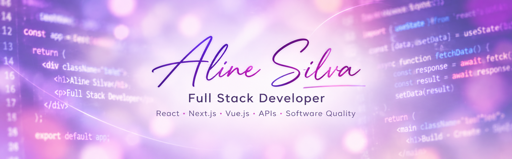

  

 

# Olá, eu sou Aline Silva 👋

**Full Stack Developer | React · Next.js · Vue.js | Software Quality**

Sou desenvolvedora Full Stack com experiência na construção e evolução de aplicações web, desde interfaces modernas e acessíveis até APIs, integrações e regras de negócio no backend.

Minha trajetória começou com design e desenvolvimento web e evoluiu para projetos envolvendo plataformas digitais, sistemas de gestão, aplicações corporativas e serviços em nuvem.

Tenho experiência com **React, Next.js, Vue.js, TypeScript, Node.js, Laravel, PHP e WordPress**, além de bancos de dados relacionais e não relacionais.

Também atuo com **qualidade de software**, realizando testes manuais desde meus projetos na **Quiker**. Atualmente, venho ampliando essa experiência com **automação de testes apoiada por inteligência artificial**, com foco em qualidade, eficiência e melhoria contínua.

## Conexões

  <a href="https://www.linkedin.com/in/alinejesus/" target="_blank">LinkedIn</a> •
  <a href="https://www.behance.net/alinejesus" target="_blank">Behance</a> •
  <a href="https://trampos.co/aline-silva" target="_blank">Trampos.co</a> •
  <a href="https://github.com/AlineJesus" target="_blank">GitHub</a>

## Tecnologias

### Frontend
React · Next.js · Vue.js · JavaScript · TypeScript · HTML · CSS · Tailwind CSS · Styled Components

### Backend
Node.js · Laravel · PHP · APIs REST · Strapi · WordPress

### Banco de dados e infraestrutura
MySQL · PostgreSQL · SQL Server · MongoDB · Redis · AWS · Docker

### Qualidade de software
QA Manual · Testes Funcionais · Cypress · Vitest · Testes E2E · IA aplicada a testes

## Experiências em destaque

### Plataformas digitais e integrações
Desenvolvimento de aplicações Full Stack, APIs e integrações entre sistemas, com atenção à manutenção, escalabilidade e regras de negócio.

### Aplicações acessíveis
Participação no desenvolvimento de solução gamificada para o ambiente acadêmico, com foco em acessibilidade visual e auditiva.

### Sistemas de gestão e aplicações web
Experiência com sistemas de gerenciamento, e-commerce, sites institucionais, landing pages e soluções web sob medida.

### Qualidade e automação
Experiência com testes manuais desde a Quiker e aprofundamento atual em automação apoiada por IA.

## Experiência profissional

- **Pyxys Inteligência Digital** — Desenvolvedora Full Stack  
- **Kuara Tec LTDA** — Desenvolvedora Full Stack  
- **Quiker** — Desenvolvedora Full Stack  
- **App4you Aplicativos** — Desenvolvedora Full Stack  
- **Levantti** — Desenvolvedora Full Stack  

## Formação

- **Análise e Desenvolvimento de Sistemas** — Anhanguera *(em andamento)*  
- **Técnico em Informática** — IFBA  
- **Formação complementar em React e Next.js** — Alura  

 

  Desenvolvimento de software • Qualidade • Aprendizado contínuo

