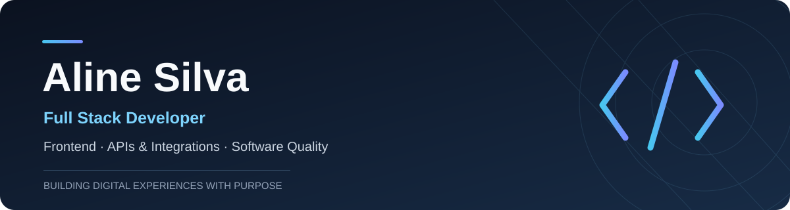

  
    
  
  
  

 

### Sobre mim

Sou **desenvolvedora Full Stack**, com foco na construção de interfaces modernas, acessíveis e na evolução de produtos digitais. Trabalho com aplicações web, APIs, integrações e regras de negócio, buscando soluções de fácil manutenção e boa experiência para as pessoas.

Minha trajetória começou com design e desenvolvimento web e evoluiu para aplicações corporativas, plataformas digitais e serviços em nuvem. Tenho experiência com **QA manual desde meus projetos na Quiker** e atualmente aplico **automação de testes apoiada por inteligência artificial**, incluindo Cypress e Vitest.

### Tecnologias

  
   
  

### O que faço

| Desenvolvimento | Qualidade de software |
| :--- | :--- |
| Interfaces em React, Next.js e Vue.js | Testes manuais e validações funcionais |
| APIs, integrações e regras de negócio | Testes E2E com Cypress |
| Laravel, Node.js e CMS como WordPress e Strapi | Vitest e IA aplicada à automação |
| Bancos de dados e infraestrutura AWS | Atenção à acessibilidade e usabilidade |

### Experiências em destaque

- **Plataformas digitais e integrações:** desenvolvimento de aplicações Full Stack, APIs e fluxos de integração entre sistemas.
- **Acessibilidade:** desenvolvimento de projeto gamificado para o contexto acadêmico, com foco em acessibilidade visual e auditiva.
- **Sistemas de gestão e e-commerce:** experiência com aplicações para cadastros, estoque, pedidos e operações empresariais.
- **QA e automação:** experiência com testes manuais desde a Quiker e aprofundamento atual em automação apoiada por IA.

### GitHub em números

  
  

As estatísticas dependem de serviços externos e podem não refletir contribuições em repositórios privados.

### Formação

Técnica em Informática pelo **IFBA** · Graduação em **Análise e Desenvolvimento de Sistemas** em andamento · Formação complementar em **React/Next.js** pela Alura.

---

  Desenvolvimento de software · Qualidade · Aprendizado contínuo

